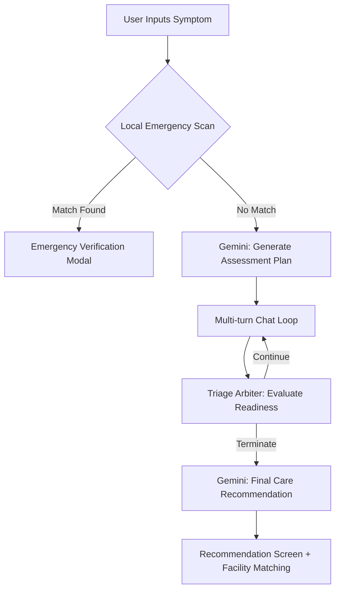
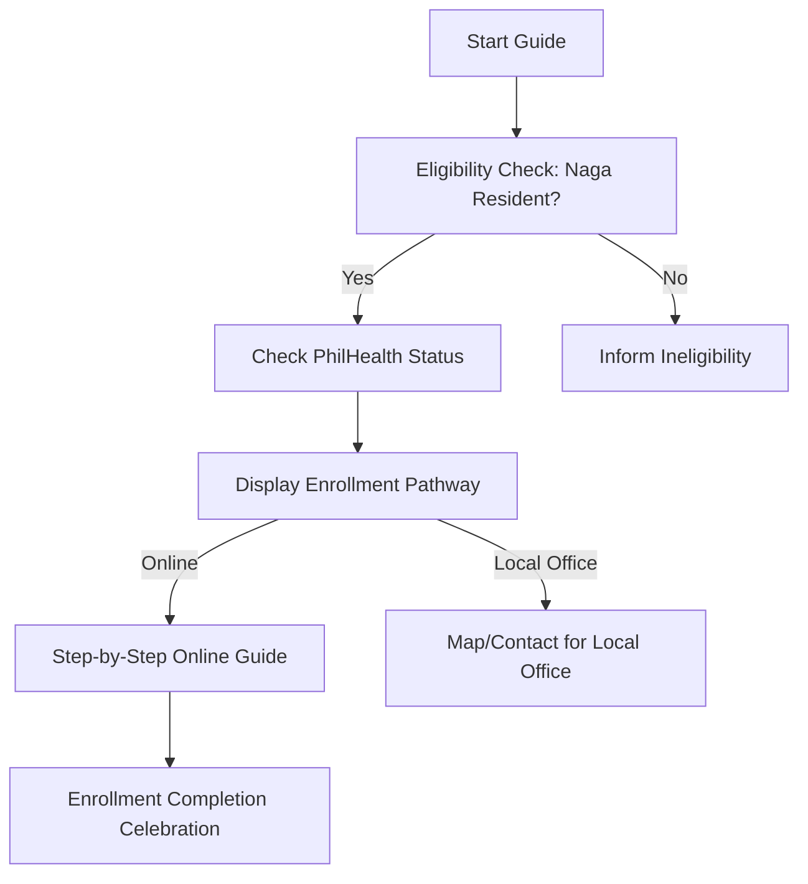
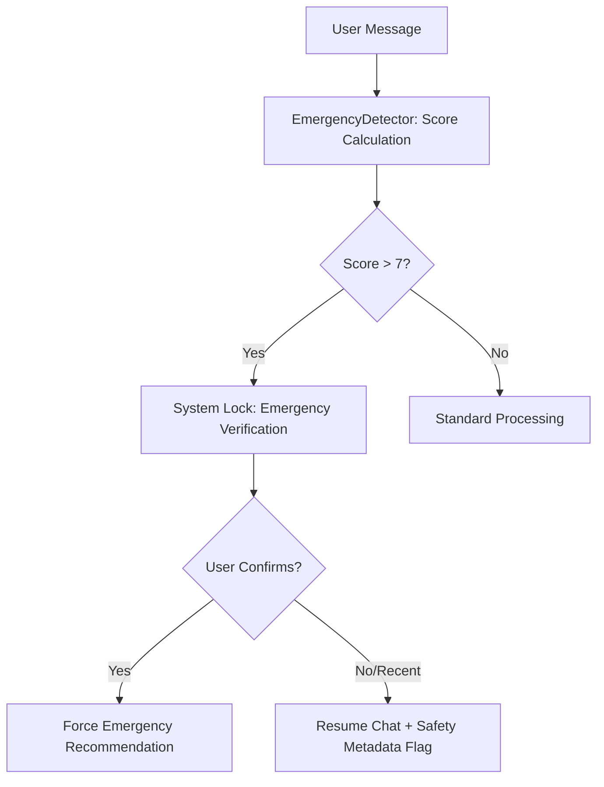

# HEALTH Application: Functional Specification & User Journey Report

**Date:** January 25, 2026  
**Role:** Senior Solutions Architect / Product Manager  
**Project:** HEALTH (Help Everyone Access Local Treatment & Healthcare)  
**Target:** Naga City, Philippines

---

## 1. Executive Feature Summary (The "What")

### Core Functional Features
*   **Conversational Symptom Assessment:** A multi-turn AI chat interface that triages user symptoms using a 3-tier clinical questioning strategy:
    *   **Tier 1 (Core):** Age, Onset/Duration, and Severity/Progression.
    *   **Tier 2 (Context):** Associated symptoms and character (e.g., sharp vs. dull pain).
    *   **Tier 3 (Ambiguity Resolution):** Systematic rule-outs based on specific clinical categories.
*   **Dynamic Care Level Recommendation:** Categorizes user condition into four levels: `self_care`, `health_center`, `hospital`, or `emergency`.
*   **Localized Facility Directory:** A comprehensive list of facilities in Naga City, featuring:
    *   **Real-time Open Status:** Visual color-coding (Green=Open, Orange=Closing soon) and "Open Now" filtering.
    *   **Proximity Sorting:** Automatic Haversine distance calculation based on user geolocation.
    *   **Service Filtering:** Capability to filter by "YAKAP Accredited," "Quiet Now" (busyness score), and specific clinical services.
*   **YAKAP Enrollment Guide:** A stateless, step-by-step informational pathway for Naga City residents to check eligibility and navigate the enrollment process.
*   **Offline Emergency Triage:** A deterministic, decision-tree-based fallback (`src/services/triageEngine.ts`) that operates without internet.
*   **Clinical Handover Reports:** Generation of a "Handover Note" in SOAP format (Subjective, Objective, Assessment, Plan) for providers.

### Feature Implementation Status
| Feature | Status | Evidence |
| :--- | :--- | :--- |
| **AI Symptom Check** | **Fully Functional** | `src/api/geminiClient.ts` & `src/screens/SymptomAssessmentScreen.tsx` |
| **Facility Sorting** | **Fully Functional** | `src/store/facilitiesSlice.ts` (GPS-based Haversine logic) |
| **YAKAP Enrollment** | **Informational Guide** | `src/features/yakap/` (Stateless UI flow) |
| **Offline Mode** | **Fully Functional** | `src/services/database.ts` (SQLite) & `src/services/triageEngine.ts` |
| **Proximity Signals**| **Functional** | `src/services/facilityService.ts` (Privacy-preserving analytics) |

### Safety Nets & Triggers
*   **Local Emergency Guard (`src/services/emergencyDetector.ts`):** 
    *   **Keyword System:** Scans for 100+ keywords in English and **Bicolano** (e.g., *hingalo*, *kulog sa daghan*, *nagkukumbulsion*).
    *   **Scoring Logic:** Symptoms are scored 1–10. A score > 7 triggers an immediate "Emergency Verification" modal.
*   **Mental Health Guard (`src/services/mentalHealthDetector.ts`):** Immediate redirection to crisis support upon detection of self-harm keywords.
*   **Conservative Triage Fallback:** If the AI's "Triage Readiness Score" is < 0.8, the system automatically upgrades the care level for safety.

---

## 2. The Core Logic & Intelligence (The "How")

### AI Triage Engine (`src/api/geminiClient.ts`)
The application utilizes **Google Gemini 2.5 Flash** with a two-phase interaction model:
1.  **Phase 1: Plan Generation:** The AI generates a structured "Assessment Plan" with up to 12 questions.
2.  **Phase 2: Slot Extraction:** After each response, the AI extracts clinical "slots" (Age, Duration, Severity, etc.).
3.  **Phase 3: Triage Arbiter (`src/services/triageArbiter.ts`):** A deterministic gatekeeper that enforces **Turn Floors** (min 4 turns for simple, 7 for complex) and detects **Clinical Saturation**.

### Ranking & Sorting (`src/store/facilitiesSlice.ts`)
Results in the Facility Directory are ranked using a multi-weighted algorithm:
1.  **Status Rank:** Open (Green) > Closing Soon (Orange) > Closed.
2.  **Distance Rank:** Secondary sort based on the Haversine distance from the user's GPS coordinates.

### Offline Mode & Persistence
*   **Offline Data:** All facility data is synced from the PostgreSQL backend to a local **Expo SQLite** database (`health_app.db`).
*   **State Persistence:** Redux Persist saves assessment progress and user settings (like PhilHealth status) across app restarts.

---

## 3. Workflow & Data Flow Visualization

### Flow A: The Symptom Check Journey

### Flow B: The YAKAP Enrollment Logic

### Flow C: Emergency System Lock

---

## 4. Pitch-Ready "Magic Moments"

*   **Multilingual Safety Engine:** The code includes a robust Bicolano-to-English mapping for emergency keywords, allowing residents to express symptoms in their mother tongue while maintaining clinical accuracy.
*   **The "Hospital Floor" Safety Protocol:** If a high-risk symptom (like slurred speech) is reported as *recently resolved*, the app prevents a "Self-Care" recommendation and enforces a "Hospital" visit to rule out transient crises.
*   **Empathetic UI/UX:** Every AI response is passed through `formatEmpatheticResponse` to ensure the tone is supportive and uses a "Grade 5 reading level," avoiding clinical jargon.
*   **Japanese-Inspired Design:** The UI uses the "Washi/Tokiwa-iro/Kitsune-iro" palette, creating a localized, professional aesthetic.

---

## 5. Architecture Snapshot

*   **Frontend:** React Native (Expo SDK 54) + TypeScript + Redux Toolkit.
*   **Backend:** Node.js/Express API with Prisma ORM and PostgreSQL (Aiven).
*   **Database:** Expo SQLite (Local) for offline facility directory.
*   **AI:** Google Gemini 2.5 Flash via direct API integration with client-side caching.
*   **Data Model (Facility):** Includes `id`, `name`, `type`, `services`, `yakapAccredited`, `latitude`, `longitude`, and `is_24_7`.
