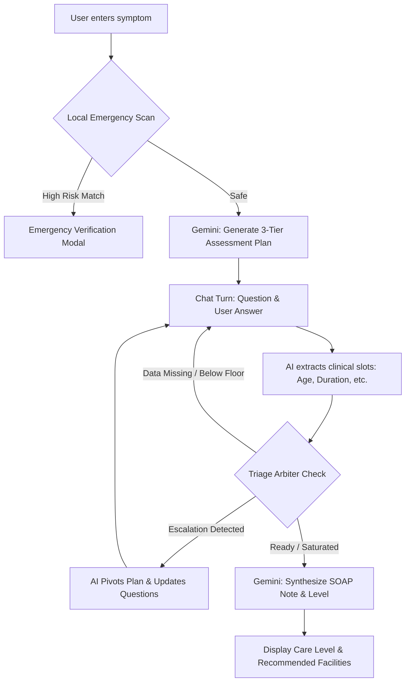
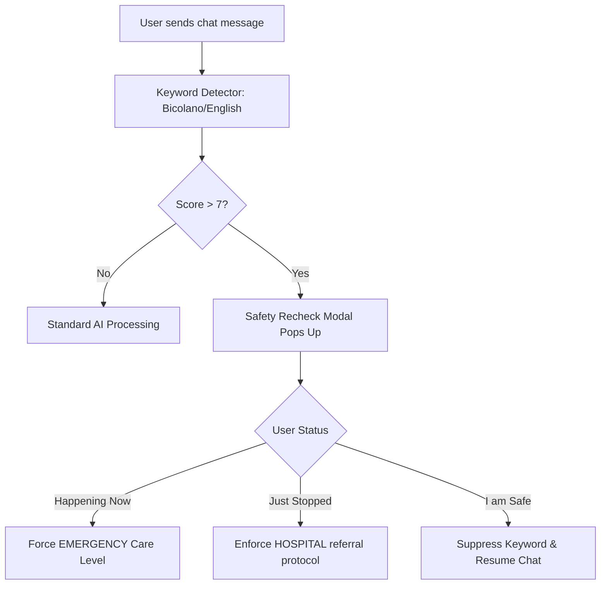
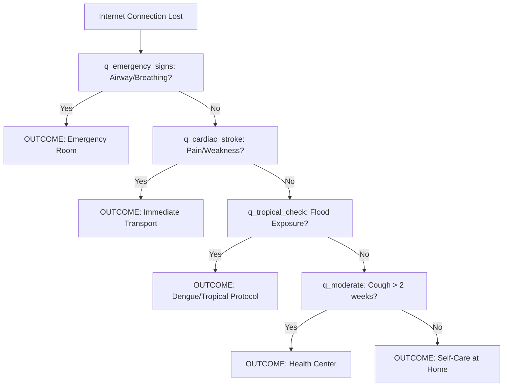
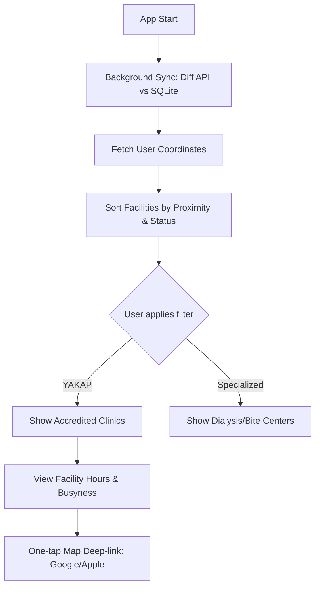
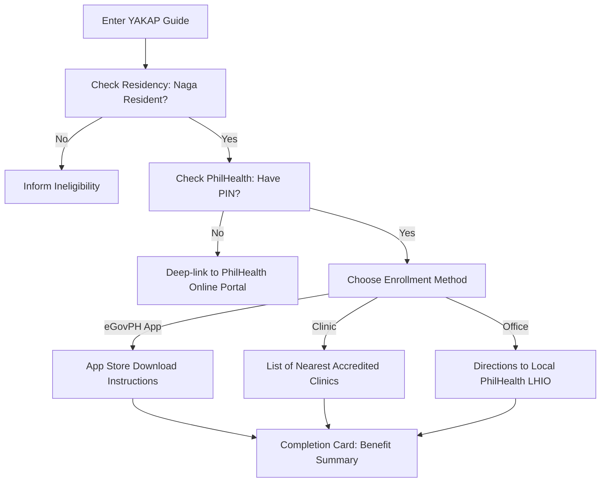
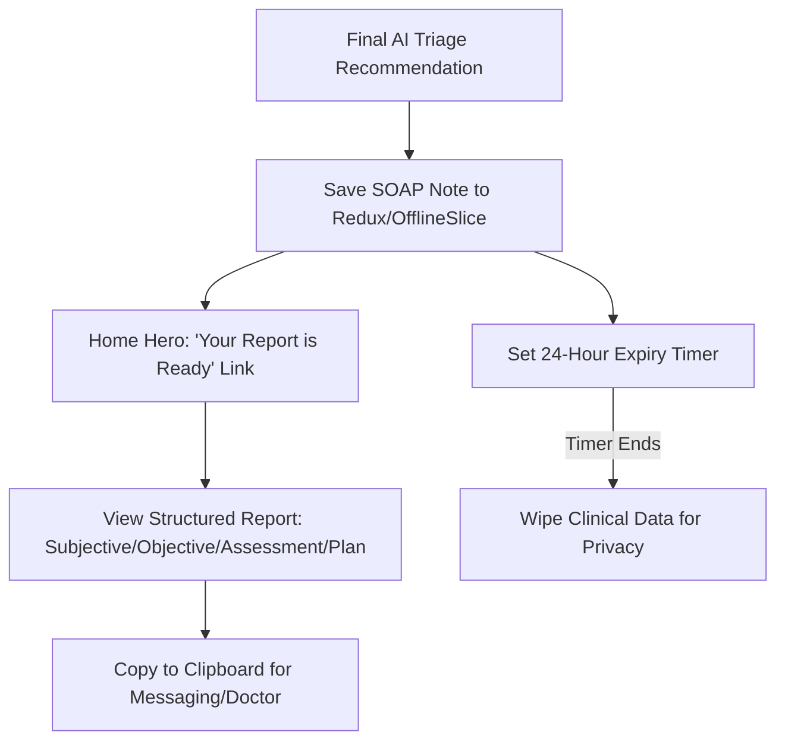

# HEALTH Application: Master Functional Specification & Workflow Architecture

**Version:** 1.0.0 (Production-Ready)  
**Project:** HEALTH (Help Everyone Access Local Treatment & Healthcare)  
**Target Region:** Naga City, Philippines  
**Deployment:** Expo SDK 54 (iOS/Android)

---

## 1. Feature Architecture Overview

### A. AI Symptom Assessment

- **Gemini 2.5 Flash Engine:** Multi-phase clinical conversation (Plan -> Extract -> Triage).
- **Triage Arbiter:** deterministic gatekeeper enforcing clinical turn floors and saturation checks.
- **Dynamic Refinement:** Assessment plan pivots if symptoms escalate mid-chat.

### B. Safety & Emergency

- **Bicolano Keyword Detector:** Scans for local dialect emergency terms.
- **System Lock:** Verification modal for 10/10 risk scenarios.
- **Hospital Floor:** Enforced referral for recently resolved high-risk symptoms.

### C. Facility Directory

- **Haversine Proximity:** GPS-based sorting of 29+ facilities.
- **Offline SQLite Sync:** Master records accessible without internet.
- **Busyness Monitoring:** Privacy-preserving proximity signals.

---

## 2. Visual Workflows (Mermaid.js)

### Workflow A: The Symptom Assessment Journey (AI Chat)

_Visualizes the complex logic from initial symptom to care recommendation._

### Workflow B: The "Safety Lock" Intervention

_Visualizes how the app interrupts the user to ensure immediate safety._

### Workflow C: Zero-Signal Offline Triage

_Visualizes the deterministic decision tree for users with no internet._

### Workflow D: Intelligent Facility Navigation

_Visualizes how the directory provides real-time guidance._

### Workflow E: YAKAP Enrollment Process

_Visualizes the stateless informational guide for free healthcare._

### Workflow F: Clinical Handover (The SOAP Continuity)

_Visualizes how data moves from chat to the doctor’s clipboard._

---

## 3. Implementation Matrix (Gap-Free Reference)

| System         | Feature                | Logic Implementation                                                    |
| :------------- | :--------------------- | :---------------------------------------------------------------------- |
| **Logic**      | **Hedging Correction** | Corrects "I don't think I have chest pain" to a safety-first verify.    |
| **Logic**      | **Saturation**         | Stops questioning if slots (Age/Duration) remain identical for 2 turns. |
| **Safety**     | **Bicolano Support**   | `nagkukumbulsion` (seizing) triggers 10/10 neuro system lock.           |
| **Privacy**    | **Proximity Hashing**  | SHA-256 daily rotating hash ensures zero user tracking.                 |
| **Navigation** | **Haversine**          | Battery-efficient math for Naga City grid coordinates.                  |
