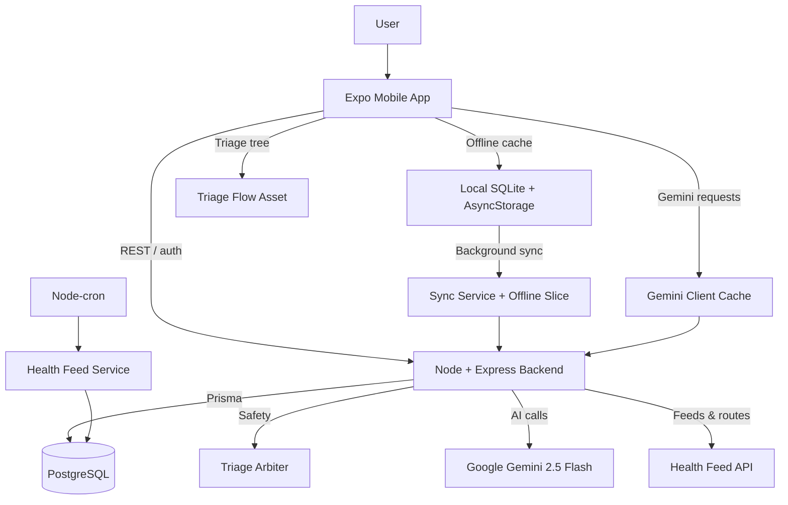

<!-- Placeholder for Logo -->

# HEALTH (Help Everyone Access Local Treatment & Healthcare)

**Healthcare Made Simple for Naga City.**

[Live Demo](https://drive.google.com/file/d/1mDuvWKPe3xmRmnvoXtVhH0FTQzFrqaNR/view?usp=drive_link) | [Video Walkthrough](https://drive.google.com/file/d/1UOtM94o0N0Fg-aS475Yhz7-aLLDkdmU7/view?usp=drive_link)

---

## TL;DR

- AI-guided triage + offline clinical notebook keeps Naga City residents out of overcrowded emergency rooms and connected to underused barangay health centers.
- Gemini-powered recommendations, Prisma/SQLite persistence, and safety guards keep each plan conservative, auditable, and synced when connectivity returns.
- Demo links above show the full flow plus the backend safeguards we highlighted for judges.

---

## Problem Statement

Naga City General Hospital (NCGH) is crowded with non-emergency cases, creating 2- to 4-hour wait times, while 27 barangay health centers sit underused. Roughly 61% of eligible residents have not enrolled in the free YAKAP healthcare program simply because they lack a clear, consistent pathway to the right service.

---

## Solution

**HEALTH** is an AI-assisted mobile guide that acts as a digital triage officer. Residents enter symptoms, location, and context; offline and online components funnel that data through a deterministic triage tree, the Triager Arbiter safety layer, and Gemini 2.5 Flash before returning the least-invasive recommendation. The app also handles offline clinical history, medication logs, facility browsing, and YAKAP enrollment guidance so users can act immediately even without signal.

---

## Impact & Metrics

- Every recommendation aims to route the user toward self-care or barangay-level care before suggesting NCGH, easing the hospital backlog.
- Offline persistence captures assessments, medication logs, and facility data in SQLite, and a rate-limited sync service replays them once authenticated.
- Support for YAKAP enrollment plus health feeds keeps 61%+ of eligible residents informed about free care options.

---

## Demo

- [Live Demo](https://drive.google.com/file/d/1mDuvWKPe3xmRmnvoXtVhH0FTQzFrqaNR/view?usp=drive_link) — walkthrough of the mobile flows.
- [Video Walkthrough](https://drive.google.com/file/d/1UOtM94o0N0Fg-aS475Yhz7-aLLDkdmU7/view?usp=drive_link) — narrated explanation of architecture, safety, and offline resilience.

---

## Architecture Overview

The Expo mobile app stays responsive offline while the backend enforces safety, storage, and health feed updates. A background sync loop runs when connectivity returns, Prisma-backed PostgreSQL stores canonical records, and Gemini 2.5 Flash only answers after the Triager Arbiter approves.

---

## Key Features

- Offline clinical notebook with SQLite tables, schema migrations, and a Redux offline slice that gates guest mode.
- Digital health ID + QR snapshot component for community health workers plus medication tracker with reminders.
- Crisis hotline hub that runs keyword detection before any Gemini request to guard emergency or mental-health flows.
- GPS-aware facility directory, teleconsult badges, and share/call/directions actions in compact cards.
- Health Hub news feed powered by nightly cron scraping plus manual sync, kept fresh in AsyncStorage.
- Guided YAKAP content, benefits, pathways, and FAQs to drive enrollment.

---

## Tech Stack

### Frontend (Mobile)

- **Framework:** Expo SDK 54 / React 19.1 / React Native 0.81 with Expo Router 6.
- **State & storage:** Redux Toolkit, Redux Persist, AsyncStorage, SQLite.
- **Networking:** Axios, date-fns, Expo Location/SQLite/SecureStore/Calendar/Haptics.
- **UI:** React Navigation, React Native Paper, QR generation, themed components.

### Backend Services (Separate Repo)

- **Runtime:** Node.js 18+, Express 5.2, dotenv, express-rate-limit.
- **ORM:** Prisma 7.3 with PostgreSQL models for facilities, clinical history, and health feed.
- **Security:** Argon2 hashing, JWT middleware, Prisma transactions.
- **AI:** @google/generative-ai to reach Gemini 2.5 Flash via the Triager Arbiter.
- **Jobs:** node-cron scraper refreshes `/api/feed/health` nightly; Prisma seeds keep facility data current.

### Development & Tools

- **Mobile:** Expo CLI / EAS, `npx expo start`, Expo Go.
- **Backend:** `npm run dev` (nodemon), `ts-node` seeding scripts, ESLint, Vitest.

---

## Getting Started

### Prerequisites

- Node.js v18+ and npm/yarn.
- PostgreSQL (or compatible) for `DATABASE_URL`.
- Expo CLI / Expo Go for mobile.
- Gemini API key for all LLM traffic.

### Backend

1. `cd backend && npm install`
2. Copy `.env.example`, set `DATABASE_URL`, `JWT_SECRET`, and `GEMINI_API_KEY`.
3. Run `npm run data:import` to load facility data.
4. Use `npm run dev` to launch the backend (it also starts the cron feed scraper).

### Mobile

1. `cd mobile && npm install`
2. Copy `.env.example` and set `EXPO_PUBLIC_BACKEND_URL` if needed; `apiConfig.ts` auto-detects Metro IP otherwise.
3. `npx expo start`
4. Scan QR with Expo Go or press `a`/`i` for emulators once the backend is seeded.

---

## Challenges

- Managing offline clinical history sync so SQLite changes persist locally, track unsynced rows, and back off on repeated 429/5xx responses (`mobile/src/services/syncService.ts`).
- Gemini rate-limiting, caching, and conservative upgrade logging to protect RPM/daily quotas while keeping the flow online (`mobile/src/api/geminiClient.ts`).
- Emergency and mental health keyword detectors that gate every triage input before calling Gemini (`mobile/src/services/emergencyDetector.ts`, `mobile/src/services/mentalHealthDetector.ts`).

---

## Future Scope

- Admin dashboard + predictive analytics built off the clinical history feed and health reports.
- Signal-based health alerts/notifications derived from Health Hub and clinical summaries.
- Private mode to keep sensitive entries local until explicit sync consent.
- Community forum and expanded Health Hub articles surfaced through Yakap content.
- Telemedicine layer with live availability and richer booking on the facility directory.
- Yakap articles & FAQs surfaced as a full knowledge base widget.

---

## Team

**CTRL+H**

- John Lester Escarlan - Project and Technical Lead | [GitHub](https://github.com/jlescarlan1)
- Nicolete Reine Guarin - Developer | [GitHub](https://github.com/aquaryasss)
- Merl Jhun Catiquista - Research and Data Collection | [GitHub](https://github.com/merljhun)
- Jen Bolat-ag - Quality Assurance | [GitHub](https://github.com/jbbolatag1-wq)
- Al Glenrey Tilacas - Creative Director | [GitHub](https://github.com/Alglenrey)

---

## Acknowledgments

- **Naga City Government** for the Mayoral Hackathon and facility data.
- **Open Source Community** for React Native and Node.js ecosystems.
